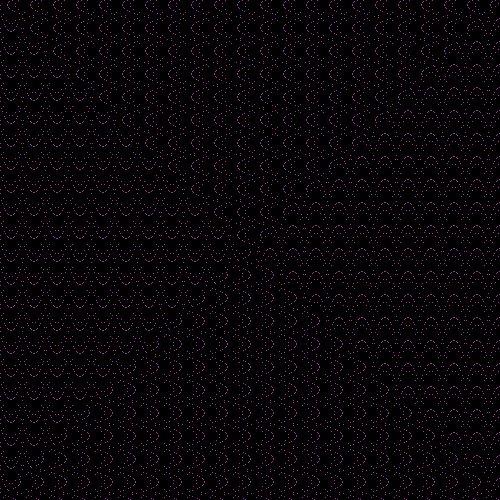

# 
Interesting Spiral Patterns I've Made For Fun 

### N % 255 [10,000x10,000] (need to zoom in)

### N % 23 [500x500]

### N % Pi < 1 [500x500] (need to zoom in)

### N % 55 [500x500]

### N * (Pi*2) % Pi < 1 [500x500] (need to zoom in)

 % Pi < 1")

### N % X < 1 (x position) [500x500]

")

NUM_MOD_7_LESS_THAN_PI.png

### N % 7 < Pi [500x500] (need to zoom in)

